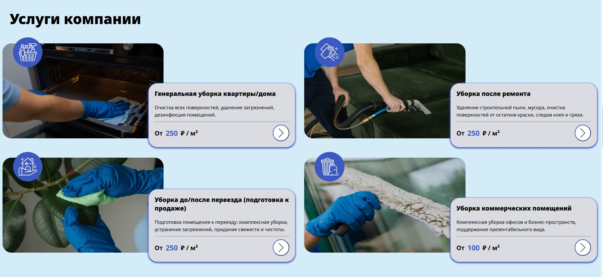
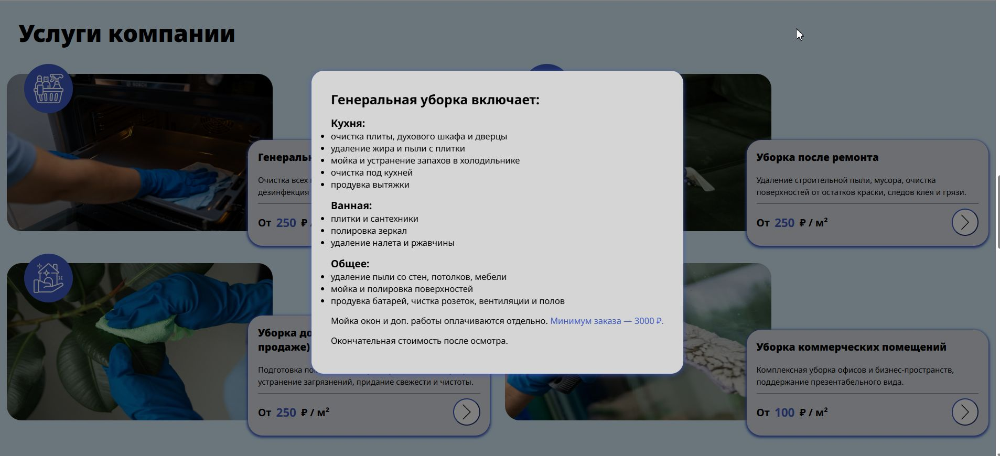

# 🧼 Уборка от Ульяны – сайт клининговой компании

Cайт для клининговой компании ***«Уборка от Ульяны»***, работающей в Калининграде. Цель — привлечение клиентов через поисковую выдачу и улучшение онлайн-присутствия.

🔗[Посмотреть сайт](https://xn-----6kcd9bjocdq0aej8in2c.xn--p1ai/)

## 🛠️ Используемые технологии
- HTML  
- CSS  
- JavaScript

## 💡 Возможности
- Просмотр информации об услугах
- Быстрые ссылки на Telegram
- Адаптивный дизайн
- Контактные данные

## 💼 Мой вклад
- 🔧 Сверстала блок "Услуги компании"
- 🎨 Стилизовала и адаптировала под мобильные устройства и планшеты
- 💬 Реализовала модальные окна на JS
- 🧭 Руководила проектом, распределяла задачи
- 📞 Общалась с заказчиком

  ## 🖼️ Превью моего рабочего блока




  
## 📌 Статус проекта  
**На поддержке**

## 🚀 Инструкция по запуску проекта

1. **Клонируйте репозиторий**
```bash
git clone  https://github.com/fauncnka14/fe91_project2_group2.git
```

2. **Перейдите в директорию проекта**
```bash
cd fe91_project2_group2
```

3. **Откройте файл `index.html` в браузере**  
Самый простой способ — использовать расширение **Live Server** в VS Code:
- Установите Live Server (если ещё не установлен)
- Кликните правой кнопкой по `index.html` → `Open with Live Server`

4. **Готово!**  
Вы можете вносить изменения в проект и сразу видеть результат в браузере.

## 👩‍💻 Команда проекта
1. **Ирина** — Project Manager, Frontend Engineer  
2. **Анна Д.** — Tech Lead, Frontend Engineer  
3. **Анна** — Designer, Frontend Engineer  
4. **Яна** — QA, Frontend Engineer  
5. **Юлия** — QA, Frontend Engineer  
6. **Айтаж** — Frontend Engineer

## 📞 Связь по вопросам поддержки
- Ирина — [@miss_Irina1](https://t.me/miss_Irina1)  
- Анна — [@apdorokhina](https://t.me/apdorokhina)
